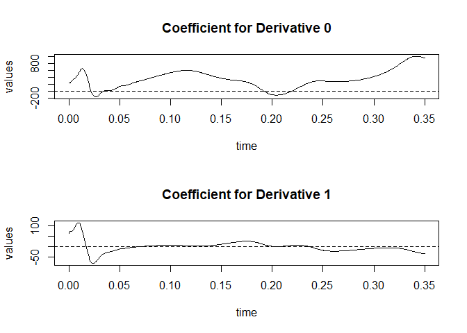
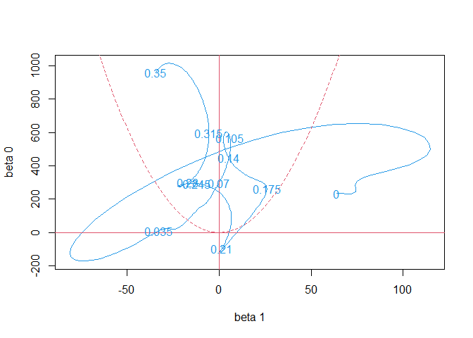

Functional Models Dynamics
================
Juan Diego Ariza Sanchez
2026-08-14

# Dynamics

We want to study rates of change and relationships among derivatives.
Exploring the relationships between derivatives in a system can provide
a useful guide to understanding its behavior.

## Principal Differential Analysis for Linear Dynamics

Linear models describing relationships between derivatives results in a
system whose behavior can be qualitatively characterized. We would now
like to characterize the behavior of a system from which we have data.

How can we fit linear dynamic models to functional data? We use the fact
that functional data analysis already gives us derivative information.
Given repeated measurements of the same process, we can model
$Dx_i(t) = -\beta (t)x_i(t)+\alpha (t) u_i(t)+ \epsilon_i(t)$. This
expression represents a functional linear regression and could be fit
with fRegress.

But assuming $u_i(t)=0$, then we want to minimize
$\sum_{i=1}^N \int [D x_i(t) + \beta (t) x_i(t)]^2dt$. **The model looks
for a linear differential operator to represent covariation between x
and Dx.** This method is principal differential analysis (PDA), similar
to PCA, since PCA looked for linear operators defined by $\beta (t)$ to
explain variation between curves while PDA looks for linear operators to
explain variation between derivatives but within curves.

Note: input-output systems which responds to changes in $u(t)$ can be
considered. Examples below do not use forcing functions, but one could
incorporate them into the code.

### Example: Lip Data

Data presents the position of the lower lip when saying the word “Bob”.
There are distinct opening and shutting phases of the mouth surrounding
a fairly linear trend that corresponds to the vocalization of the vowel.
Muscle tissue behaves in many ways like a spring. This observations
suggests that we consider fitting a second-order equation to these data.

The following code attempts to derive a second-order homogeneous
differential equation like
$D^2 x(t)=-\beta_1 (t)Dx(t) - \beta_0(t) x(t)$ for lipfd obtained from
smoothing the lip data with no smoothing in the coefficients b0(t) and
b1(t):

``` r
lipfd = smooth.basisPar(liptime, lip, 6,Lfdobj=int2Lfd(4), lambda=1e-12)$fd
names(lipfd$fdnames) = c("time(seconds)","replications", "mm")
lipbasis = lipfd$basis
plot(lipfd)
```

<!-- -->

    ## [1] "done"

Now, we set the objects and run the command ´pda.fd´

``` r
# 1. Crear xfdlist como una lista
xfdlist <- list(lipfd)

# 2. Crear el objeto fdPar para los coeficientes beta
lipfd0 <- fd(matrix(0, lipbasis$nbasis, 1), lipbasis)
lipfdPar <- fdPar(lipfd0, 2, 0)

# 3. Crear bwtlist. Para una ecuación de segundo orden, se necesitan 2 coeficientes
bwtlist <- list(lipfdPar, lipfdPar)

# 4. Ejecutar el análisis
pdaList <- pda.fd(xfdlist, bwtlist)
```

Now we plot

``` r
plot(pdaList,whichdim=3)
```

<!-- -->

From this we see that there is an initial explosive motion as the lips,
previously sealed, are opened. This is followed by a period where the
motion of the lips is largely oscillatory with a period of about 30-40
ms. This corresponds approximately to the spring constant of flaccid
muscle tissue. During the “o” phase of the word, there is a period of
damped behavior when the lips are kept open in order to enunciate the
vowel.

``` r
pda.overlay(pdaList)
```

<!-- -->
