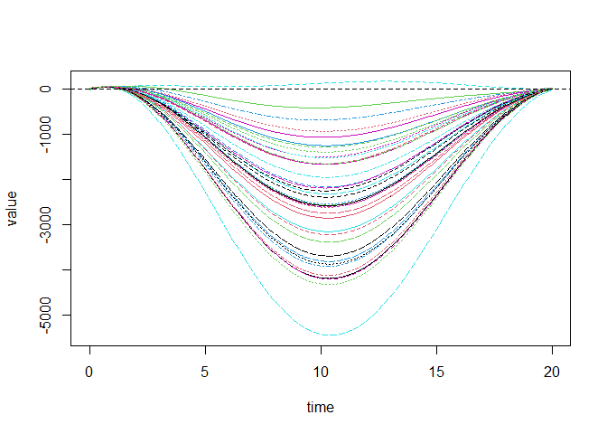

Functions_Functions (Ramsay)
================
Juan Diego Ariza Sanchez
2026-08-11

# Functional Linear Models

This is a Markdown that implements the most basic models explained in
the book of Ramsay, the codes in here can be used for future reference.
Some mathematical notation will also be deployed.

## Functional Linear Models for Functional Responses

Now, the response variable is functional. However, this review will
evaluate two cases for the independent variables:

1.  **Scalars**

2.  **Functions**

    2.1 **Concurrent**: The value of the response variable $y(t)$ is
    predicted solely by the values of one or more functional covariates
    at the same time $t$.

    2.2 **General**: Functional variables contribute to the prediction
    for all possible time values.

### Scalars as independent variables

Here we will extend the classical ANOVA to a functional ANOVA (fANOVA).
The example will be done by measuring the effect of geographic location
(Atlantic, Pacific, Prairie and Arctic) on the shape of the temperature
curves of Canadian weather stations. Then, the model is: $$
y_i(t) = \beta_0 (t) + \sum_{j=1}^4 x_{ij} \beta_j(t) + \epsilon_i(t)
$$

Here, $x_{ij}$ is a dummy variable and $\beta_0 (t)$ accounts for the
mean temperature in Canada. Now, we create the variable for the model
with the correct constraints.

``` r
#Extract regions
regions = unique(CanadianWeather$region)

#Matrix dimension
p = length(regions) + 1

#Z matrix
regionList = vector("list", p)
regionList[[1]] = c(rep(1,35),0)
for (j in 2:p) {
  xj = CanadianWeather$region == regions[j-1]
  regionList[[j]] = c(xj,1)
}

#Add constraint
coef = tempfd$coef
coef36 = cbind(coef,matrix(0,65,1))
temp36fd = fd(coef36,tempbasis,tempfd$fdnames)
```

We now create functional parameter objects for each of the coefficient
functions, using 11 Fourier basis functions for each.

``` r
betabasis = create.fourier.basis(c(0, 365), 11)
betafdPar = fdPar(betabasis)
betaList = vector("list",p)
for (j in 1:p) betaList[[j]] = betafdPar
```

To run the model, simply:

``` r
fRegressList = fRegress(temp36fd, regionList,betaList)
betaestList = fRegressList$betaestlist
regionFit = fRegressList$yhatfd
regions = c("Canada", regions)
par(mfrow=c(2,3),cex=1)
for (j in 1:p) {
  plot(betaestList[[j]]$fd, lwd=2,  xlab="Day (July 1 to June 30)",  ylab="", 
       main=regions[j])
}
plot(regionFit, lwd=2, col=1, lty=1, xlab="Day", ylab="", main="Prediction")
```

<!-- -->

    ## [1] "done"

The regression coefficients estimated for predicting temperature from
climate region. The first panel is the intercept coefficient,
corresponding to the Canadian mean temperature. The last panel contains
the predicted mean temperatures for the four regions.

### Concurrent: Functions as independent variables

We extend the model to:

$$
y_i(t) = \beta_0 (t) + \sum_{j=1}^{q-1} x_{ij}(t) \beta_j(t) + \epsilon_i(t)
$$ This model is called concurrent because it only relates the value of
$y_i(t)$ to the value of $x_{ij}(t)$ at the same time points $t$. The
intercept function $\beta_0(t)$ in effect multiplies a scalar covariate
whose value is always one, and captures the variation in the response
that does not depend on any of the covariate functions.

Warning= Here multicollinearity is often referred to as concurvity.It
bring the same problem as in classic models.

The data we will use here are measurements of angle at the hip and knee
of 39 children as they walk through a single gait cycle. This analysis
is inspired by the question, “How much control does the hip angle have
over the knee angle?”

``` r
gaittime <- as.matrix((1:20) / 21)
gaitrange <- c(0, 20)
gaitbasis <- create.fourier.basis(gaitrange, nbasis = 21)
harmaccelLfd <- vec2Lfd(c(0, (2 * pi / 20)^2, 0), rangeval = gaitrange)
gaitfd <- smooth.basisPar(gaittime, gait, gaitbasis, Lfdobj = harmaccelLfd, lambda = 1e-2)$fd

# Extract knee angle functional data object
kneefd <- gaitfd[, 2]
hipfd <- gaitfd[, 1]
```

Now, we run the model as:

``` r
#Variables
xfdlist = list(rep(1,39), hipfd)
betafdPar = fdPar(gaitbasis, harmaccelLfd)
betalist = list(betafdPar,betafdPar)

#Model
fRegressList = fRegress(kneefd, xfdlist, betalist)

#Estimations
kneehatfd = fRegressList$yhatfd
betaestlist = fRegressList$betaestlist
```

Some plots can be done:

``` r
plot(kneehatfd)
```

<!-- -->

    ## [1] "done"

The quality of the model can be assesed by:

``` r
# Var-Cov Matrix
kneehatmat = eval.fd(gaittime, kneehatfd)
resmat. = gait[,,2] - kneehatmat
SigmaE = cov(t(resmat.))

#RSQR
kneemeanfd = mean.fd(kneefd)
kneefinemat = eval.fd(gaitrange, kneefd)
kneemeanvec = eval.fd(gaitrange, kneemeanfd)
kneehatfinemat = eval.fd(gaitrange, kneehatfd)
resmat = kneefinemat - kneehatfinemat
resmat0 = kneefinemat - (kneemeanvec %*% matrix(1,1,39))
SSE0 = apply((resmat0)^2, 1, sum)
SSE1 = apply(resmat^2, 1, sum)
Rsqr = (SSE0-SSE1)/SSE0
```

Other functions as hypothesis testing can be done!
