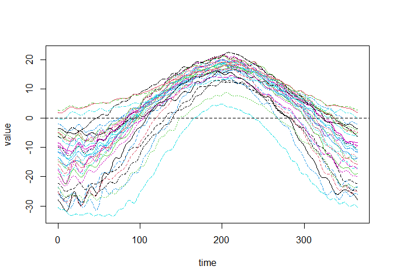
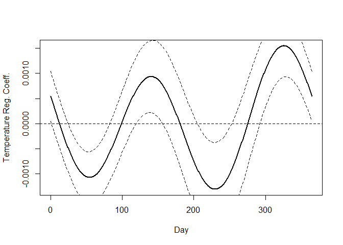
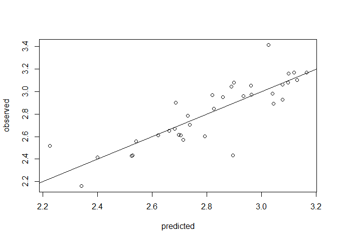
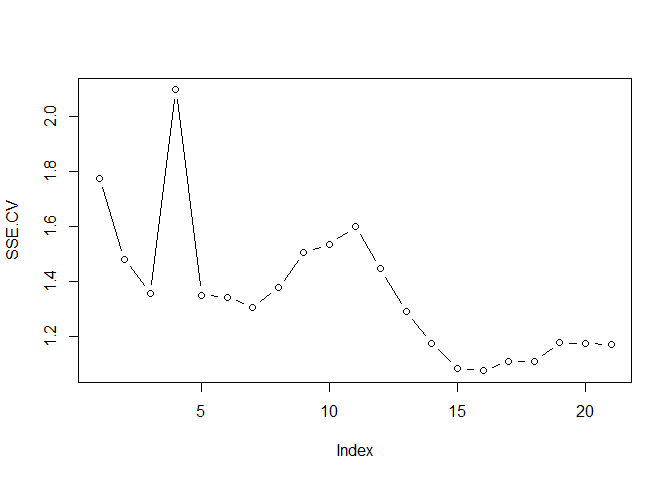
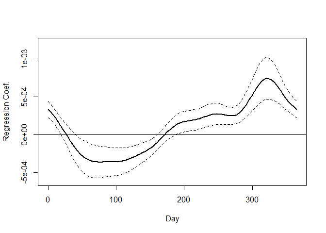
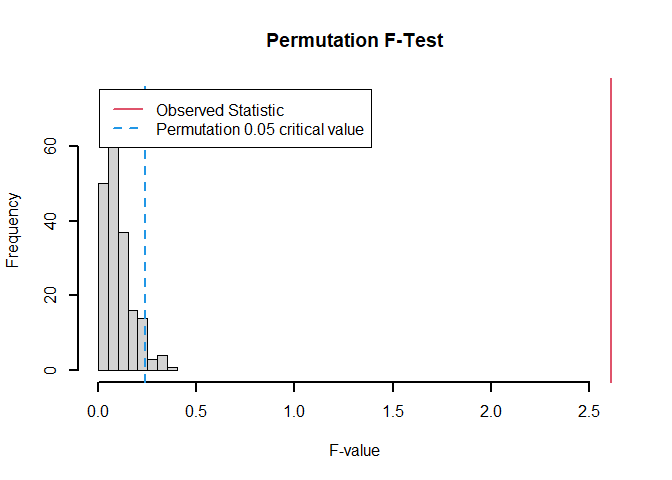

Linear Models Version1 - Ramsay
================
Juan Diego Ariza Sanchez
2026-07-30

# Functional Linear Models

This is a Markdown that implements the most basic models explained in
the book of Ramsay, the codes in here can be used for future reference.
Some mathematical notation will also be deployed.

## Functional Linear Models for Scalar Responses

Similar as the multivariate linear model but exploiting the mesh of
times one have the following functional linear model for scalar
response: $$
y_i = \alpha_0 + \int x_i(t)\beta (t) dt + \epsilon_i
$$ How to estimate $\beta(t)$? There are two options:

- Use a basis coefficient expansion $\beta(t) = \sum_k^K c_k \phi_k(t)$
- Use PCA

### Example

Here we model the logarithm of annual precipitation for 35 Canadian
weather stations from their temperature profiles. In other words, $y_i$
is the log annual precipitation and $x_i(t)$ are the temperature
profiles. Now, lets create the scalar variable (annualprec) and the
functional one (tempfd)

``` r
# Scalar variable
annualprec = log10(apply(daily$precav,2,sum))
# Functional variable
tempbasis =create.fourier.basis(c(0,365),65)
tempSmooth=smooth.basis(day.5,daily$tempav,tempbasis)
tempfd =tempSmooth$fd
```

For educational purpouses, let’s plot the functional variable

``` r
plot(tempfd)
```

<!-- -->

    ## [1] "done"

And now, let’s create the regressor structure

``` r
templist = vector("list",2)
templist[[1]] = rep(1,35)
templist[[2]] = tempfd
```

#### First strategy to estimate $\beta(t)$

Keep the dimensionality $K$ of $b$ small relative to $N$. Here let’s set
$K=5$.

``` r
conbasis = create.constant.basis(c(0,365))
betabasis = create.fourier.basis(c(0,365),5)
betalist = vector("list",2)
betalist[[1]] = conbasis
betalist[[2]] = betabasis
```

Now, we run the function *fRegress*

``` r
fRegressList = fRegress(annualprec,templist,betalist)
```

The result *betaestlist* contains the estimated regression coefficient
functions. Each of these is a functional parameter object. We can plot
the estimate of the regression function for the temperature profiles:

``` r
betaestlist = fRegressList$betaestlist
# Intercept
coef(betaestlist[[1]])
```

    ##          [,1]
    ## [1,] 3.464844

``` r
#Beta (t)
tempbetafd = betaestlist[[2]]$fd
plot(tempbetafd, xlab="Day", ylab="Beta for temperature")
```

<!-- -->

    ## [1] "done"

##### Quality of the strategy 1

Let’s assess the quality of the previous fit, we can compute the error
sums of squares

``` r
# Estimated y (\hat(y))
annualprechat1 = fRegressList$yhatfdobj
# Errors
annualprecres1 = annualprec - annualprechat1
# SES
SSE1.1 = sum(annualprecres1^2) #Our model
SSE0 = sum((annualprec - mean(annualprec))^2) #Null model
```

We can now compute the squared multiple correlation and the usual
F-ratio for comparing these two fits.

``` r
(RSQ1 = (SSE0-SSE1.1)/SSE0)
```

    ## [1] 0.7955986

``` r
(Fratio1 = ((SSE0-SSE1.1)/5)/(SSE1.1/29))
```

    ## [1] 22.57554

##### How to obtain confidence intervals on the estimations?

Notice we’re assuming $\epsilon_i$ are independently normally
distributed around zero with variance $\sigma_e^2$. Lets use
*fRegress.stderr*:

``` r
resid = annualprec - annualprechat1
SigmaE.= sum(resid^2)/(35-fRegressList$df)
SigmaE = SigmaE.*diag(rep(1,35))
y2cMap = diag(rep(1,35))
fRegressList2 = fRegress(annualprec, templist, betalist, y2cMap = y2cMap, SigmaE = SigmaE) 
fRegressList2$yfdobj = fRegressList2$yvec
stderrList = fRegress.stderr(fRegressList2, y2cMap,SigmaE)
```

Then is plus minus that sigma

``` r
betafdPar = betaestlist[[2]]
betafd = betafdPar$fd
betastderrList = stderrList$betastderrlist
betastderrfd = betastderrList[[2]]
plot(betafd, xlab="Day",
ylab="Temperature Reg. Coeff.", lwd=2)#ylim=c(-6e-4,1.2e-03))
```

    ## [1] "done"

``` r
lines(betafd+2*betastderrfd, lty=2, lwd=1)
lines(betafd-2*betastderrfd, lty=2, lwd=1)
```

<!-- -->

ATTENTION: these intervals are given pointwise!

#### Second strategy to estimate $\beta(t)$

Here we will include a roughness penalty instead of using a
low-dimension basis. The combination of a high-dimensional basis with a
roughness penalty reduces the possibilities that either (a) important
features are missed or (b) extraneous features are forced into the image
by using a basis set that is too small for the application. This is a
more powerful approach! More than one functional covariate can be
incorporated into this model and scalar covariates may also be included.

``` r
Lcoef = c(0,(2*pi/365)^2,0)
harmaccelLfd = vec2Lfd(Lcoef, c(0,365))
```

Now we replace our previous choice of basis for defining the $\beta$
estimate by a functional parameter object that incorporates both this
roughness penalty and a level of smoothing

``` r
betabasis = create.fourier.basis(c(0, 365), 35)
# Smoothing parameter
lambda = 10^15 
betafdPar = fdPar(betabasis, harmaccelLfd, lambda)
betalist[[2]] = betafdPar
```

Now we estimate the model 2

``` r
annPrecTemp = fRegress(annualprec, templist, betalist)
# Betas estimate
betaestlist2 = annPrecTemp$betaestlist
# \hat(y)
annualprechat2 = annPrecTemp$yhatfdobj
```

And we assess quality of model 2

``` r
SSE1.2 = sum((annualprec-annualprechat2)^2)
(RSQ2 = (SSE0 - SSE1.2)/SSE0)
```

    ## [1] 0.7173324

``` r
(Fratio2 = ((SSE0-SSE1.2)/3.7)/(SSE1.2/30.3))
```

    ## [1] 20.7819

The F-ratio test shows that model 2 is even more significant than for
the simple model 1.

``` r
plot(annualprechat2, annualprec, xlab="predicted", ylab = "observed")
abline(a=0,b=1)
```

<!-- -->

##### How to choose the smoothing parameter?

Here we choose it through a cross-validation score defined as

$$
CV(\lambda) = \sum_{i=1}^N(\frac{(y_i - \hat{y}_i)^2}{(1-H_{ii})})
$$

And the search would be done by:

``` r
#grid search
loglam = seq(5,15,0.5)
nlam = length(loglam)
#store results
SSE.CV = matrix(0,nlam,1)
#loop search
N <- length(annualprec)
for (ilam in 1:nlam) {
  lambda = 10^loglam[ilam]
  betalisti = betalist
  betafdPar2 = betalisti[[2]]
  betafdPar2$lambda = lambda
  betalisti[[2]] = betafdPar2
  yhat.cv <- numeric(N)
  for (i in 1:N) {
    yi <- annualprec[-i]
    xfdlisti <- list(rep(1, N-1), tempfd[-i])
    fRegi <- fRegress(yi, xfdlisti, betalisti)
    
    beta0hat  <- as.numeric(eval.fd(0, fRegi$betaestlist[[1]]$fd))
    betafdhat <- fRegi$betaestlist[[2]]$fd
    
    yhat.cv[i] <- beta0hat + inprod(tempfd[i], betafdhat)
  }
  SSE.CVi <- sum((annualprec - yhat.cv)^2)
  SSE.CV[ilam] = SSE.CVi
}
```

    ## Warning in eigchk(Cmat): Near singularity in coefficient matrix.

    ## 
    ## Log10 Eigenvalues range from
    ##  -0.20550632802533  to  11.7950049268259

    ## Warning in eigchk(Cmat): Near singularity in coefficient matrix.

    ## 
    ## Log10 Eigenvalues range from
    ##  -0.249998747097594  to  11.7950049268257

    ## Warning in eigchk(Cmat): Near singularity in coefficient matrix.

    ## 
    ## Log10 Eigenvalues range from
    ##  -0.248372311229503  to  11.7950049268257

``` r
plot(SSE.CV, type = "b")
```

<!-- -->

#### Third Strategy to Estimate $\beta(t)$

Here we regress $y$ on the principal component scores for functional
covariate. The techinque is:

1.  Perform a principal components analysis on the covariate matrix $X$
    and derive the principal components scores $f_{ij}$ for each
    observation $i$ on each principal component $j$.
2.  Regress the response $y_i$ on the principal component scores
    $c_{ij}$.

Then the model would be: $$
y_i = \beta_0 + \int \sum \beta_j \xi_j(t) (x_{ij}(t) - \bar{x}(t))dt + \epsilon_i
$$ Where our parameter is then $\beta(t) = \sum \beta_j \xi_j(t)$

First, we smooth with roughness parameter:

``` r
daybasis365=create.fourier.basis(c(0, 365), 365)
lambda =1e6
tempfdPar =fdPar(daybasis365, harmaccelLfd, lambda)
tempfd =smooth.basis(day.5, daily$tempav,tempfdPar)$fd
```

Now we do fPCA

``` r
lambda = 1e0
tempfdPar = fdPar(daybasis365, harmaccelLfd, lambda)
temppca = pca.fd(tempfd, 4, tempfdPar)
harmonics = temppca$harmonics
```

Finally, do the linear model using principal component scores and to
construct the corresponding functional data objects for the regression
functions.

``` r
# Model lm classic
pcamodel = lm(annualprec~temppca$scores)
# Estimates
pcacoefs = summary(pcamodel)$coef
# Beta functional
betafd = pcacoefs[2,1]*harmonics[1] +
          pcacoefs[3,1]*harmonics[2] +
          pcacoefs[4,1]*harmonics[3]
# Variation
coefvar = pcacoefs[,2]^2
betavar = coefvar[2]*harmonics[1]^2 +
          coefvar[3]*harmonics[2]^2 +
          coefvar[4]*harmonics[3]^2
plot(betafd, xlab="Day", ylab="Regression Coef.",
ylim=c(-6e-4,1.2e-03), lwd=2)
```

<!-- -->

    ## [1] "done"

One can see the estimates, with the confidence intervals:

``` r
tfine <- seq(0, 365, length.out = 101)

betafd_vals  <- eval.fd(tfine, betafd)
betavar_vals <- eval.fd(tfine, betavar)

plot(tfine, betafd_vals, type = "l", xlab = "Day", ylab = "Regression Coef.",
     ylim = c(-6e-4, 1.2e-03), lwd = 2)
lines(tfine, betafd_vals + 2*sqrt(betavar_vals), lty = 2, lwd = 1)
lines(tfine, betafd_vals - 2*sqrt(betavar_vals), lty = 2, lwd = 1)
abline(h=0)
```

<!-- -->

##### Statistical Test

The statistic is calculated several hundred times using a different
random permutation each time. The p value for the test can then be
calculated by counting the proportion of permutation F values that are
larger than the F statistic for the observed pairing. The observed test
statistic is in the tail of this distribution, we conclude that there is
a relationship between the response and covariates.

``` r
F.res = Fperm.fd(annualprec, templist, betalist)
```

<!-- -->
